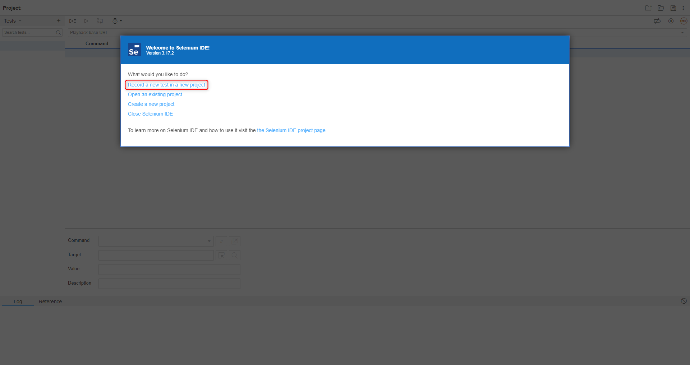
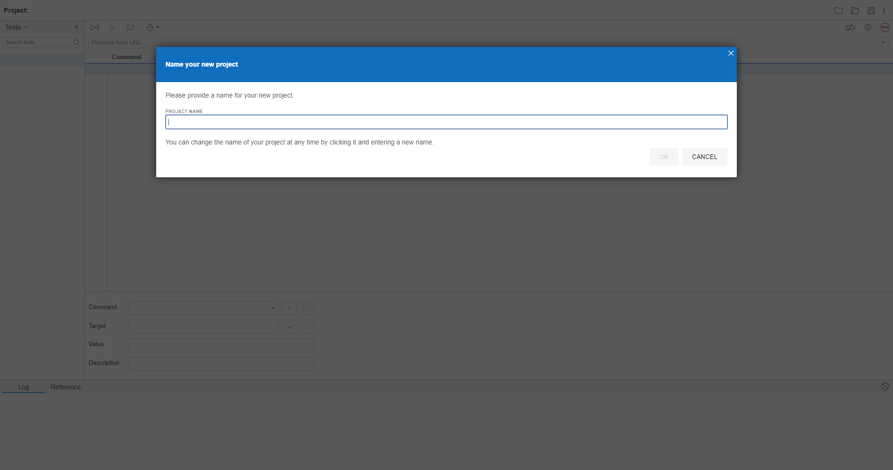
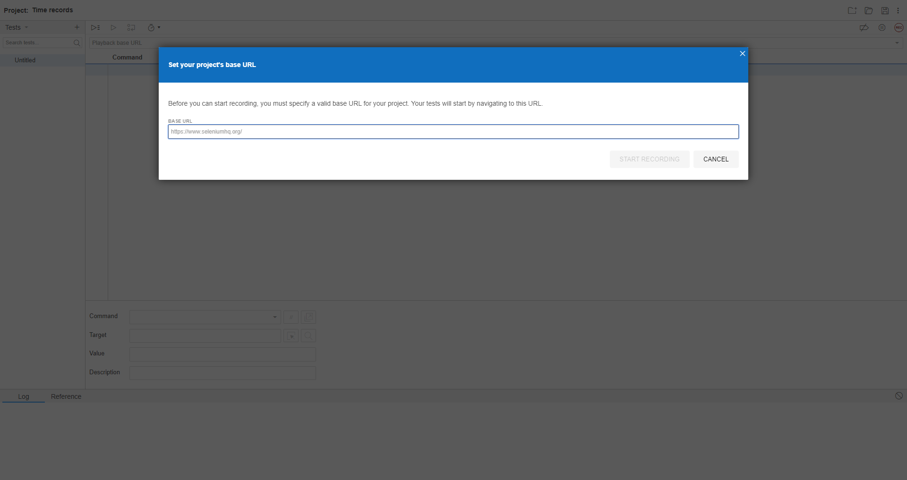
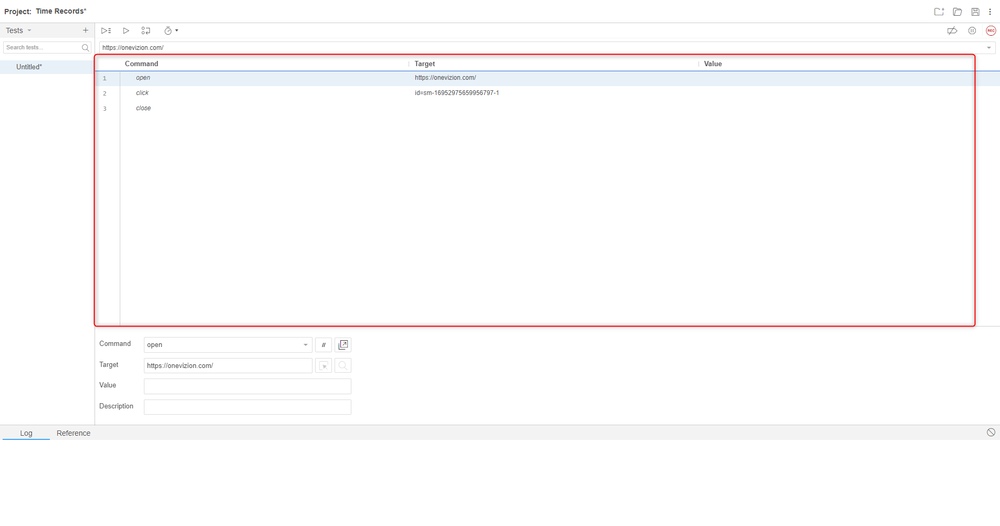
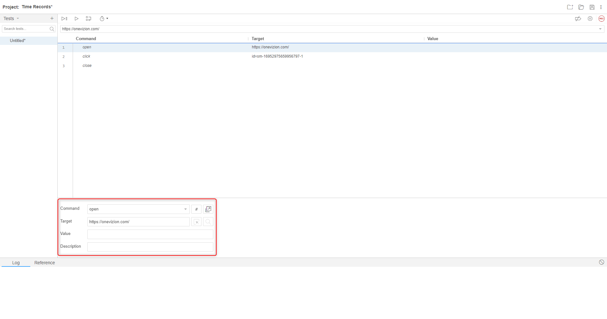

## Installing Selenium IDE
- Go to the official Selenium IDE website: https://www.selenium.dev/selenium-ide/
- Download the selenium IDE extension to your browser.

## Recording a test case
- Launch the Selenium IDE extension in your browser.
- Click "Record a new test in a new project" and enter a name in the `Project Name` input field.

- Enter a name in the `Project Name` input field.

- Enter a base url of website in the input field `Base url` and click `Start Recording` button.

- After entering all the data, the base URL that you entered will open.
- Every action you will perform will be recorded in `Commands window`.

- Each record contains 4 components:
-- The `Command` represents the action or operation you want Selenium IDE to perform. It is a keyword that tells Selenium what to do. Examples of common commands include "click," "type," "wait," "assert," and many others.
--  The `Target` specifies the web element(s) on which the command should be executed. It serves as a locator or identifier for the element. The Target can be expressed using various locators, such as XPath, CSS selectors, IDs, class names, or link text, depending on the specific command and the element you want to interact with.
-- The `Value` field is used to provide additional information or data required for the execution of the command. The content of the Value field can vary depending on the command being used. For instance, if you're using the "type" command, the Value would contain the text you want to input into an input field.
-- The `Description` field is an optional component. It allows you to add a human-readable description of the command.

